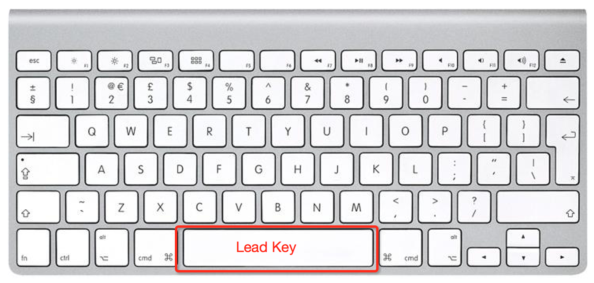

Start Working with VIM in 60 min
=========================

This tutorial helps engineers without much VIM background to get start easily, focusing on popular user cases in daily development. Trust me, you'll love it!

Thanks [@luonet](https://github.com/luonet/dotfiles) for sharing such a powerful tool to make the installation a piece of cake!

# Install VIM and Useful Plugins

See [Automatic Installer](https://github.com/luonet/dotfiles/blob/master/README.md) for more details.

For those who have no Chinese background, pls simply execute following command in your console:

```
sh -c "`curl -fsSL https://raw.githubusercontent.com/luonet/dotfiles/master/install`"
```

NOTE: This tool has been tested on ubuntu 14.04 and MAC(Yosemite). It might, depending on your internet speed, take about an hour to upgrade/install vim and plugins.

Also, you can customize your favorite configurations in ~/.vimrc. And you can see all installed plugins by

```
:PluginList
```

# Handy Techniques

Read the conventions(default VIM configurations) before you start playing with VIM.

## Conventions



## Basic

Open a project/directory

```
vi [directory]
```

Hide/Show file navigator

```
<lead> t
```

Open split window into multiple pieces

```
:split
```

Open a VimShell to run shell without switching to another window

```
<lead> c
```

View help

```
:help [key-words]
```

## Advance


